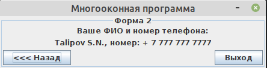

# TSN_Idea_MultiForms
Пример простейшего многооконного визуального приложения на Swing для IntelliJ IDEA на Java




Main.java
```
package kz.talipovsn.ij.multiforms;

import javax.swing.*;

// Основной класс-запускатель программы
public class Main {

    static StringBuilder data = new StringBuilder(); // Общая переменная для всех форм

    static JFrame form1; // Общая ссылка на форму 1
    static JFrame form2; // Общая ссылка на форму 2

    // Точка входа в программу
    public static void main(String[] args) {
        SwingUtilities.invokeLater(() -> {
            form1 = new Form1(); // Создаем в памяти форму 1
            form2 = new Form2(); // Создаем в памяти форму 2
            form1.setVisible(true); // Делаем видимой форму 1
        });
    }
}
```

Form1.java
```
package kz.talipovsn.ij.multiforms;

import javax.swing.*;
import java.awt.*;

// Форма 1
public class Form1 extends JFrame {

    private JButton nextButton;
    private JTextField textField_Fio;
    private JPanel panel1;
    private JTextField textField_tel;

    public Form1() {
        // Инициализация компонент
        getContentPane().add(panel1);
        setResizable(false);
        setIconImage(Toolkit.getDefaultToolkit().createImage(getClass().getResource("icon.png")));
        setDefaultCloseOperation(EXIT_ON_CLOSE);
        setTitle("Многооконная программа");
        pack();
        setLocationRelativeTo(null);

        // Кнопка "Далее"
        nextButton.addActionListener(actionEvent -> {
            // Очистим общую переменную
            Main.data.setLength(0);

            String s1 = textField_Fio.getText(); // Узнаем ФИО
            String s2 = textField_tel.getText(); // Узнаем телефон

            // Сохраняем нужные данные в общую переменную
            if (!s1.equals("")) {
                Main.data.append(s1);
                if (!s2.equals("")) {
                    Main.data.append(", номер: ").append(s2);
                }
            } else {
                Main.data.append("???");
            }

            Main.form1.setVisible(false); // Скрываем форму 1
            Main.form2.setVisible(true); // Делаем видимой форму 2
        });

    }

}
```

Form2.java
```
package kz.talipovsn.ij.multiforms;

import javax.swing.*;
import java.awt.*;
import java.awt.event.WindowAdapter;

// Форма 2
public class Form2 extends JFrame {
    private JPanel panel2;
    private JButton priorButton;
    private JButton exitButton;
    private JLabel label_Data;

    public Form2() {
        // Инициализация компонент
        getContentPane().add(panel2);
        setResizable(false);
        setIconImage(Toolkit.getDefaultToolkit().createImage(getClass().getResource("icon.png")));
        setDefaultCloseOperation(EXIT_ON_CLOSE);
        setTitle("Многооконная программа");
        pack();
        setLocationRelativeTo(null);

        // Кнопка "Назад"
        priorButton.addActionListener(actionEvent -> {
            Main.form2.setVisible(false); // Скрываем форму 2
            Main.form1.setVisible(true);  // Делаем видимой форму 1
        });

        // Кнопка "Выход"
        exitButton.addActionListener(actionEvent -> System.exit(0));

        // Переопределяем нужные нам обработчики событий для окна
        addWindowListener(new WindowAdapter() {
            // Открытие окна
            @Override
            public void windowActivated(java.awt.event.WindowEvent evt) {
                // Устанавливаем данные из общей переменной
                label_Data.setText(Main.data.toString());
            }
        });
    }

}
```
